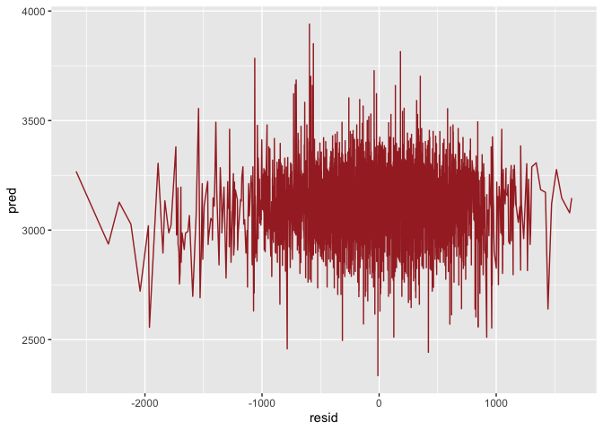
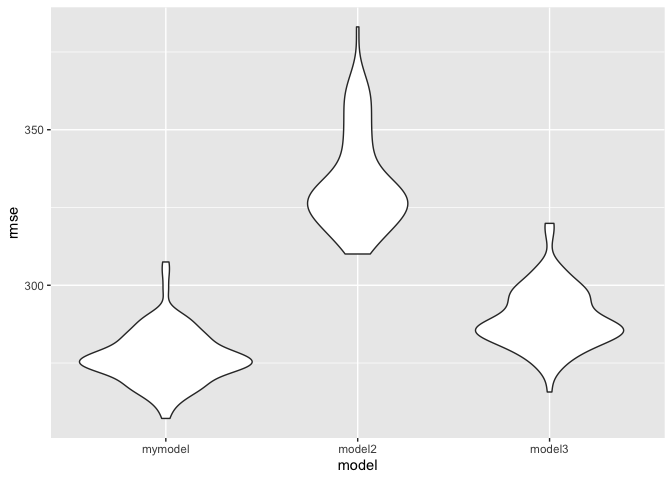
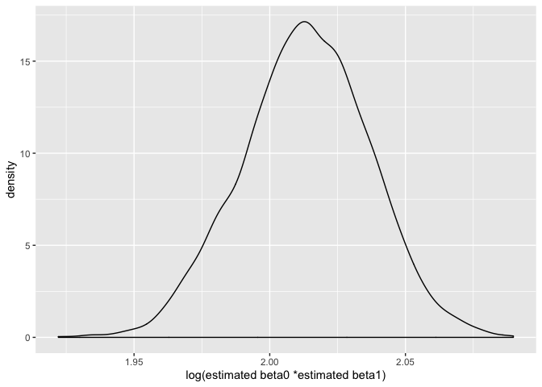
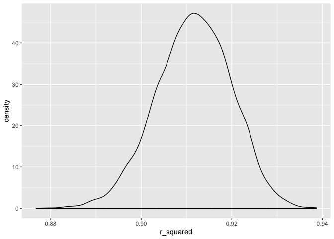

p8105\_hw6\_jl5549
================

# Problem1

``` r
birthweight = read_csv(file = './data/birthweight.csv') %>% 
  janitor::clean_names() %>% 
  mutate(babysex = as.factor(babysex),
         momage = as.factor(momage)) %>% 
  drop_na()
```

    ## Parsed with column specification:
    ## cols(
    ##   .default = col_double()
    ## )

    ## See spec(...) for full column specifications.

``` r
head(birthweight)
```

    ## # A tibble: 6 x 20
    ##   babysex bhead blength   bwt delwt fincome frace gaweeks malform menarche
    ##   <fct>   <dbl>   <dbl> <dbl> <dbl>   <dbl> <dbl>   <dbl>   <dbl>    <dbl>
    ## 1 2          34      51  3629   177      35     1    39.9       0       13
    ## 2 1          34      48  3062   156      65     2    25.9       0       14
    ## 3 2          36      50  3345   148      85     1    39.9       0       12
    ## 4 1          34      52  3062   157      55     1    40         0       14
    ## 5 2          34      52  3374   156       5     1    41.6       0       13
    ## 6 1          33      52  3374   129      55     1    40.7       0       12
    ## # … with 10 more variables: mheight <dbl>, momage <fct>, mrace <dbl>,
    ## #   parity <dbl>, pnumlbw <dbl>, pnumsga <dbl>, ppbmi <dbl>, ppwt <dbl>,
    ## #   smoken <dbl>, wtgain <dbl>

``` r
mymodel =step(lm(bwt ~ ., data = birthweight), direction = "backward", k=log(nrow(birthweight)))
```

    ## Start:  AIC=49127.61
    ## bwt ~ babysex + bhead + blength + delwt + fincome + frace + gaweeks + 
    ##     malform + menarche + mheight + momage + mrace + parity + 
    ##     pnumlbw + pnumsga + ppbmi + ppwt + smoken + wtgain
    ## 
    ## 
    ## Step:  AIC=49127.61
    ## bwt ~ babysex + bhead + blength + delwt + fincome + frace + gaweeks + 
    ##     malform + menarche + mheight + momage + mrace + parity + 
    ##     pnumlbw + pnumsga + ppbmi + ppwt + smoken
    ## 
    ## 
    ## Step:  AIC=49127.61
    ## bwt ~ babysex + bhead + blength + delwt + fincome + frace + gaweeks + 
    ##     malform + menarche + mheight + momage + mrace + parity + 
    ##     pnumlbw + ppbmi + ppwt + smoken
    ## 
    ## 
    ## Step:  AIC=49127.61
    ## bwt ~ babysex + bhead + blength + delwt + fincome + frace + gaweeks + 
    ##     malform + menarche + mheight + momage + mrace + parity + 
    ##     ppbmi + ppwt + smoken
    ## 
    ##            Df Sum of Sq       RSS   AIC
    ## - momage   32   4436052 329004012 48919
    ## - ppbmi     1         4 324567964 49119
    ## - malform   1      5072 324573032 49119
    ## - frace     1     15680 324583640 49119
    ## - mheight   1     19125 324587085 49119
    ## - ppwt      1     90512 324658473 49120
    ## - menarche  1    259040 324827000 49123
    ## - parity    1    422515 324990475 49125
    ## <none>                  324567960 49128
    ## - fincome   1    740498 325308458 49129
    ## - babysex   1    984939 325552900 49132
    ## - mrace     1   1756130 326324090 49143
    ## - smoken    1   3064411 327632371 49160
    ## - gaweeks   1   4679144 329247104 49181
    ## - delwt     1   7461071 332029031 49218
    ## - blength   1 104365842 428933802 50330
    ## - bhead     1 113907942 438475903 50425
    ## 
    ## Step:  AIC=48918.52
    ## bwt ~ babysex + bhead + blength + delwt + fincome + frace + gaweeks + 
    ##     malform + menarche + mheight + mrace + parity + ppbmi + ppwt + 
    ##     smoken
    ## 
    ##            Df Sum of Sq       RSS   AIC
    ## - ppbmi     1       177 329004189 48910
    ## - malform   1      5314 329009326 48910
    ## - mheight   1     16312 329020324 48910
    ## - frace     1     36531 329040543 48911
    ## - menarche  1     63089 329067101 48911
    ## - ppwt      1     69149 329073160 48911
    ## - parity    1    440024 329444035 48916
    ## <none>                  329004012 48919
    ## - babysex   1   1046080 330050091 48924
    ## - fincome   1   1643154 330647166 48932
    ## - mrace     1   1909493 330913505 48935
    ## - smoken    1   3025038 332029050 48950
    ## - gaweeks   1   5280393 334284405 48979
    ## - delwt     1   7126552 336130564 49003
    ## - blength   1 106659399 435663411 50129
    ## - bhead     1 114562643 443566654 50207
    ## 
    ## Step:  AIC=48910.14
    ## bwt ~ babysex + bhead + blength + delwt + fincome + frace + gaweeks + 
    ##     malform + menarche + mheight + mrace + parity + ppwt + smoken
    ## 
    ##            Df Sum of Sq       RSS   AIC
    ## - malform   1      5328 329009517 48902
    ## - frace     1     36566 329040755 48902
    ## - menarche  1     62955 329067144 48903
    ## - parity    1    440344 329444533 48908
    ## <none>                  329004189 48910
    ## - mheight   1    652922 329657111 48910
    ## - babysex   1   1046426 330050615 48916
    ## - fincome   1   1642998 330647187 48923
    ## - mrace     1   1909966 330914155 48927
    ## - ppwt      1   2838635 331842824 48939
    ## - smoken    1   3025033 332029222 48942
    ## - gaweeks   1   5281399 334285588 48971
    ## - delwt     1   7127957 336132146 48995
    ## - blength   1 106659222 435663412 50121
    ## - bhead     1 114636201 443640390 50200
    ## 
    ## Step:  AIC=48901.84
    ## bwt ~ babysex + bhead + blength + delwt + fincome + frace + gaweeks + 
    ##     menarche + mheight + mrace + parity + ppwt + smoken
    ## 
    ##            Df Sum of Sq       RSS   AIC
    ## - frace     1     36794 329046311 48894
    ## - menarche  1     63227 329072744 48894
    ## - parity    1    440083 329449600 48899
    ## <none>                  329009517 48902
    ## - mheight   1    651487 329661005 48902
    ## - babysex   1   1044425 330053942 48907
    ## - fincome   1   1640562 330650080 48915
    ## - mrace     1   1912318 330921835 48919
    ## - ppwt      1   2847200 331856717 48931
    ## - smoken    1   3020422 332029939 48933
    ## - gaweeks   1   5278864 334288382 48963
    ## - delwt     1   7146996 336156513 48987
    ## - blength   1 106661358 435670876 50113
    ## - bhead     1 114659436 443668953 50192
    ## 
    ## Step:  AIC=48893.95
    ## bwt ~ babysex + bhead + blength + delwt + fincome + gaweeks + 
    ##     menarche + mheight + mrace + parity + ppwt + smoken
    ## 
    ##            Df Sum of Sq       RSS   AIC
    ## - menarche  1     65591 329111903 48886
    ## - parity    1    441076 329487388 48891
    ## <none>                  329046311 48894
    ## - mheight   1    660704 329707015 48894
    ## - babysex   1   1044124 330090435 48899
    ## - fincome   1   1674048 330720359 48908
    ## - ppwt      1   2850345 331896656 48923
    ## - smoken    1   3009625 332055937 48925
    ## - gaweeks   1   5282183 334328495 48955
    ## - mrace     1   6507709 335554021 48971
    ## - delwt     1   7133627 336179938 48979
    ## - blength   1 106676377 435722689 50105
    ## - bhead     1 114677204 443723515 50184
    ## 
    ## Step:  AIC=48886.43
    ## bwt ~ babysex + bhead + blength + delwt + fincome + gaweeks + 
    ##     mheight + mrace + parity + ppwt + smoken
    ## 
    ##           Df Sum of Sq       RSS   AIC
    ## - parity   1    433976 329545879 48884
    ## - mheight  1    619106 329731009 48886
    ## <none>                 329111903 48886
    ## - babysex  1   1049166 330161069 48892
    ## - fincome  1   1680472 330792375 48900
    ## - ppwt     1   2843366 331955269 48915
    ## - smoken   1   3029707 332141610 48918
    ## - gaweeks  1   5267967 334379869 48947
    ## - mrace    1   6558118 335670021 48964
    ## - delwt    1   7246252 336358155 48973
    ## - blength  1 106835723 435947625 50099
    ## - bhead    1 114612879 443724782 50175
    ## 
    ## Step:  AIC=48883.78
    ## bwt ~ babysex + bhead + blength + delwt + fincome + gaweeks + 
    ##     mheight + mrace + ppwt + smoken
    ## 
    ##           Df Sum of Sq       RSS   AIC
    ## - mheight  1    609943 330155822 48883
    ## <none>                 329545879 48884
    ## - babysex  1   1087696 330633575 48890
    ## - fincome  1   1646710 331192589 48897
    ## - ppwt     1   2891872 332437751 48913
    ## - smoken   1   3037467 332583346 48915
    ## - gaweeks  1   5066066 334611945 48942
    ## - mrace    1   6618022 336163901 48962
    ## - delwt    1   7329176 336875055 48971
    ## - blength  1 106662814 436208692 50093
    ## - bhead    1 114940226 444486105 50175
    ## 
    ## Step:  AIC=48883.43
    ## bwt ~ babysex + bhead + blength + delwt + fincome + gaweeks + 
    ##     mrace + ppwt + smoken
    ## 
    ##           Df Sum of Sq       RSS   AIC
    ## <none>                 330155822 48883
    ## - babysex  1   1134157 331289979 48890
    ## - fincome  1   1783532 331939354 48898
    ## - ppwt     1   2554058 332709880 48909
    ## - smoken   1   3002692 333158513 48914
    ## - gaweeks  1   4982884 335138706 48940
    ## - mrace    1   7575850 337731672 48974
    ## - delwt    1   7676777 337832599 48975
    ## - blength  1 108304546 438460368 50107
    ## - bhead    1 114773103 444928925 50170

``` r
summary(mymodel)
```

    ## 
    ## Call:
    ## lm(formula = bwt ~ babysex + bhead + blength + delwt + fincome + 
    ##     gaweeks + mrace + ppwt + smoken, data = birthweight)
    ## 
    ## Residuals:
    ##      Min       1Q   Median       3Q      Max 
    ## -1086.18  -183.73    -4.68   173.85  2450.49 
    ## 
    ## Coefficients:
    ##               Estimate Std. Error t value Pr(>|t|)    
    ## (Intercept) -5923.5368    99.3058 -59.649  < 2e-16 ***
    ## babysex2       32.9994     8.5543   3.858 0.000116 ***
    ## bhead         134.7480     3.4723  38.807  < 2e-16 ***
    ## blength        76.7689     2.0365  37.697  < 2e-16 ***
    ## delwt           3.9704     0.3956  10.036  < 2e-16 ***
    ## fincome         0.8245     0.1704   4.838 1.36e-06 ***
    ## gaweeks        11.9288     1.4753   8.086 7.94e-16 ***
    ## mrace         -58.7947     5.8971  -9.970  < 2e-16 ***
    ## ppwt           -2.4748     0.4275  -5.789 7.58e-09 ***
    ## smoken         -3.6543     0.5822  -6.277 3.79e-10 ***
    ## ---
    ## Signif. codes:  0 '***' 0.001 '**' 0.01 '*' 0.05 '.' 0.1 ' ' 1
    ## 
    ## Residual standard error: 276.1 on 4332 degrees of freedom
    ## Multiple R-squared:   0.71,  Adjusted R-squared:  0.7094 
    ## F-statistic:  1179 on 9 and 4332 DF,  p-value: < 2.2e-16

``` r
#a plot of model residuals against fitted values
birthweight %>% 
  add_predictions(mymodel) %>% 
  add_residuals(mymodel) %>% 
  ggplot(aes(x = pred, y = resid))+
  geom_point(col = 'brown') +
  geom_line(stat = "smooth", method = "lm")
```

<!-- -->

``` r
broom::glance(mymodel)
```

    ## # A tibble: 1 x 11
    ##   r.squared adj.r.squared sigma statistic p.value    df  logLik    AIC
    ##       <dbl>         <dbl> <dbl>     <dbl>   <dbl> <int>   <dbl>  <dbl>
    ## 1     0.710         0.709  276.     1179.       0    10 -30561. 61144.
    ## # … with 3 more variables: BIC <dbl>, deviance <dbl>, df.residual <int>

I used “Backward Elimination” method to build my model to remove the
variable with lowest significance every time.

``` r
cv_df =
  birthweight %>% 
  crossv_mc(.,n = 100) %>% 
  mutate(
    train = map(train, as_tibble),
    test = map(test, as_tibble)
  ) 
#calculate there models' rmse
cv_df= 
  cv_df%>% 
  mutate(
    model1 = map(train, ~lm(bwt ~ babysex + bhead + blength + delwt + fincome + gaweeks +  mrace + ppwt + smoken, data = .)),
    model2 = map(train, ~lm(bwt~blength+gaweeks, data = .)),
    model3 = map(train, ~lm(bwt~bhead*blength*babysex, data= .))
    ) %>% 
  mutate(rmse_mymodel = map2_dbl(model1, test, ~rmse(model = .x, data = .y)),
    rmse_model2 = map2_dbl(model2, test, ~rmse(model = .x, data = .y)),
         rmse_model3 = map2_dbl(model3, test, ~rmse(model = .x, data = .y)))
#compare three models 
cv_df %>% 
  select(starts_with('rmse')) %>%
  pivot_longer(everything(),
    names_to = 'model',
               values_to = 'rmse',
               names_prefix = 'rmse_')%>% 
  mutate(model= factor(model, levels = c('mymodel', 'model2', 'model3'))) %>% 
  ggplot(aes(x= model , y = rmse))+
  geom_violin()
```

<!-- -->

According to the violin plot above we can see my model has lowest rmse
which means it does better in prediction than other two models. And
model2 has highest rmse. It has lowest predictive accuracy.

## Problem 2

``` r
#import the data
weather_df = 
  rnoaa::meteo_pull_monitors(
    c("USW00094728"),
    var = c("PRCP", "TMIN", "TMAX"), 
    date_min = "2017-01-01",
    date_max = "2017-12-31") %>%
  mutate(
    name = recode(id, USW00094728 = "CentralPark_NY"),
    tmin = tmin / 10,
    tmax = tmax / 10) %>%
  select(name, id, everything())
```

    ## Registered S3 method overwritten by 'crul':
    ##   method                 from
    ##   as.character.form_file httr

    ## Registered S3 method overwritten by 'hoardr':
    ##   method           from
    ##   print.cache_info httr

    ## file path:          /Users/crystal/Library/Caches/rnoaa/ghcnd/USW00094728.dly

    ## file last updated:  2019-09-26 21:45:43

    ## file min/max dates: 1869-01-01 / 2019-09-30

``` r
#boostrap datasets and build model for each
weather_models = 
weather_df %>% 
  bootstrap(n = 5000) %>% 
  mutate(models = map(strap, ~lm(tmax~tmin, data = .x))) 
#tidy the models and extract statistics
estimates = 
  weather_models%>% 
  mutate(results = map(models, broom::tidy)) %>% 
  select(-models, -strap) %>% 
  unnest(results) %>% 
  pivot_wider(values_from = 'estimate',
              names_from = 'term') %>%
  janitor::clean_names() 
#extract beta0 and beta1
intercept = 
  estimates %>% 
   select(intercept, id) %>% 
   drop_na()
tmin = 
  estimates %>% 
   select(tmin, id) %>% 
   drop_na()
#calculate log(β̂ 0∗β̂ 1)
beta = inner_join(intercept, tmin, by = "id") %>% 
  mutate(log_beta01 = log(intercept*tmin))
#distribution of log(β̂ 0∗β̂ 1)
beta %>% 
  ggplot(aes(x =log_beta01))+
  geom_density()+
  labs(x = 'log(estimated beta0 *estimated beta1)')
```

<!-- -->

``` r
#2.5% and 97.5% quantiles
q1_log_beta01= quantile(beta$log_beta01, 0.025)
q2_log_beta01 = quantile(beta$log_beta01, 0.975)
# construct CIs
se_log_beta01 = sd(beta$log_beta01)/sqrt(length(beta$log_beta01))
mean_log_beta01 = mean(beta$log_beta01)
CI_log_beta01 = c(mean_log_beta01 - qnorm(0.975)*se_log_beta01,
                  mean_log_beta01 + qnorm(0.975)*se_log_beta01)
CI_log_beta01
```

    ## [1] 2.012255 2.013565

The shape of log(estimated beta0 *estimated beta1) is close to normal.
The mean is 2.0129099. The CI of log(beta0 * beta1) is (2.0122547,
2.0135652)

``` r
#find r^ 2
r2 =   
  weather_models%>% 
  mutate(results = map(models, broom::glance)) %>% 
  select(-models, -strap) %>% 
  unnest(results) %>% 
  janitor::clean_names()
r2 %>% 
  ggplot(aes(x = r_squared))+
  geom_density()
```

<!-- -->

``` r
#2.5% and 97.5% quantiles
q1_r2= quantile(r2$r_squared, 0.025)
q2_r2= quantile(r2$r_squared, 0.975)
# construct CIs
se_rsquared = sd(r2$r_squared)/sqrt(length(r2$r_squared))
mean_rsquared = mean(r2$r_squared)
CI_rsquared = c(mean_rsquared - qnorm(0.975)*se_rsquared,
                  mean_rsquared + qnorm(0.975)*se_rsquared)
CI_rsquared
```

    ## [1] 0.9113489 0.9118097

The shape of r^2 is close to normal. The mean is0.9115793. The CI of r^2
is (0.9113489, 0.9118097)
