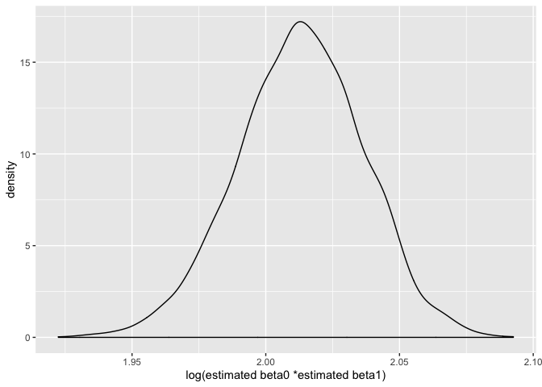

p8105\_hw6\_jl5549
================

# Problem1

``` r
birthweight = read_csv(file = './data/birthweight.csv') %>% 
  janitor::clean_names() %>% 
  mutate(babysex = as.factor(babysex),
         momage = as.factor(momage)) %>% 
  drop_na()
```

    ## Parsed with column specification:
    ## cols(
    ##   .default = col_double()
    ## )

    ## See spec(...) for full column specifications.

``` r
head(birthweight)
```

    ## # A tibble: 6 x 20
    ##   babysex bhead blength   bwt delwt fincome frace gaweeks malform menarche
    ##   <fct>   <dbl>   <dbl> <dbl> <dbl>   <dbl> <dbl>   <dbl>   <dbl>    <dbl>
    ## 1 2          34      51  3629   177      35     1    39.9       0       13
    ## 2 1          34      48  3062   156      65     2    25.9       0       14
    ## 3 2          36      50  3345   148      85     1    39.9       0       12
    ## 4 1          34      52  3062   157      55     1    40         0       14
    ## 5 2          34      52  3374   156       5     1    41.6       0       13
    ## 6 1          33      52  3374   129      55     1    40.7       0       12
    ## # … with 10 more variables: mheight <dbl>, momage <fct>, mrace <dbl>,
    ## #   parity <dbl>, pnumlbw <dbl>, pnumsga <dbl>, ppbmi <dbl>, ppwt <dbl>,
    ## #   smoken <dbl>, wtgain <dbl>

``` r
mymodel = lm(bwt~ wtgain*fincome, data = birthweight)
summary(mymodel)
```

    ## 
    ## Call:
    ## lm(formula = bwt ~ wtgain * fincome, data = birthweight)
    ## 
    ## Residuals:
    ##      Min       1Q   Median       3Q      Max 
    ## -2587.94  -286.07    14.79   318.42  1644.56 
    ## 
    ## Coefficients:
    ##                  Estimate Std. Error t value Pr(>|t|)    
    ## (Intercept)    2636.08030   32.87667  80.181  < 2e-16 ***
    ## wtgain           15.42720    1.33145  11.587  < 2e-16 ***
    ## fincome           5.05012    0.65519   7.708 1.58e-14 ***
    ## wtgain:fincome   -0.08776    0.02690  -3.263  0.00111 ** 
    ## ---
    ## Signif. codes:  0 '***' 0.001 '**' 0.01 '*' 0.05 '.' 0.1 ' ' 1
    ## 
    ## Residual standard error: 489.1 on 4338 degrees of freedom
    ## Multiple R-squared:  0.08851,    Adjusted R-squared:  0.08788 
    ## F-statistic: 140.4 on 3 and 4338 DF,  p-value: < 2.2e-16

``` r
#a plot of model residuals against fitted values
birthweight %>% 
  select(bwt, wtgain,fincome) %>% 
  add_predictions(mymodel) %>% 
  add_residuals(mymodel) %>% 
  ggplot(aes(x = resid, y = pred))+
  geom_line(col = 'brown')
```

<!-- -->

``` r
broom::glance(mymodel)
```

    ## # A tibble: 1 x 11
    ##   r.squared adj.r.squared sigma statistic  p.value    df  logLik    AIC
    ##       <dbl>         <dbl> <dbl>     <dbl>    <dbl> <int>   <dbl>  <dbl>
    ## 1    0.0885        0.0879  489.      140. 7.87e-87     4 -33047. 66105.
    ## # … with 3 more variables: BIC <dbl>, deviance <dbl>, df.residual <int>

``` r
cv_df =
  birthweight %>% 
  crossv_mc(.,n = 100) %>% 
  mutate(
    train = map(train, as_tibble),
    test = map(test, as_tibble)
  ) 
cv_df= 
  cv_df%>% 
  mutate(
    model1 = map(train, ~lm(bwt~ wtgain*fincome, data = .)),
    model2 = map(train, ~lm(bwt~blength+gaweeks, data = .)),
    model3 = map(train, ~lm(bwt~bhead*blength*babysex, data= .))
    ) %>% 
  mutate(rmse_mymodel = map2_dbl(model1, test, ~rmse(model = .x, data = .y)),
    rmse_model2 = map2_dbl(model2, test, ~rmse(model = .x, data = .y)),
         rmse_model3 = map2_dbl(model3, test, ~rmse(model = .x, data = .y)))
cv_df %>% 
  select(starts_with('rmse')) %>%
  pivot_longer(everything(),
    names_to = 'model',
               values_to = 'rmse',
               names_prefix = 'rmse_')%>% 
  mutate(model= factor(model, levels = c('mymodel', 'model2', 'model3'))) %>% 
  ggplot(aes(x= model , y = rmse))+
  geom_violin()
```

<!-- -->

## Problem 2

``` r
#import the data
weather_df = 
  rnoaa::meteo_pull_monitors(
    c("USW00094728"),
    var = c("PRCP", "TMIN", "TMAX"), 
    date_min = "2017-01-01",
    date_max = "2017-12-31") %>%
  mutate(
    name = recode(id, USW00094728 = "CentralPark_NY"),
    tmin = tmin / 10,
    tmax = tmax / 10) %>%
  select(name, id, everything())
```

    ## Registered S3 method overwritten by 'crul':
    ##   method                 from
    ##   as.character.form_file httr

    ## Registered S3 method overwritten by 'hoardr':
    ##   method           from
    ##   print.cache_info httr

    ## file path:          /Users/crystal/Library/Caches/rnoaa/ghcnd/USW00094728.dly

    ## file last updated:  2019-09-26 21:45:43

    ## file min/max dates: 1869-01-01 / 2019-09-30

``` r
#boostrap datasets and build model for each
weather_models = 
weather_df %>% 
  bootstrap(n = 5000) %>% 
  mutate(models = map(strap, ~lm(tmax~tmin, data = .x))) 
#tidy the models and extract statistics
estimates = 
  weather_models%>% 
  mutate(results = map(models, broom::tidy)) %>% 
  select(-models, -strap) %>% 
  unnest(results) %>% 
  pivot_wider(values_from = 'estimate',
              names_from = 'term') %>%
  janitor::clean_names() 
#extract beta0 and beta1
intercept = 
  estimates %>% 
   select(intercept, id) %>% 
   drop_na()
tmin = 
  estimates %>% 
   select(tmin, id) %>% 
   drop_na()
#calculate log(β̂ 0∗β̂ 1)
beta = inner_join(intercept, tmin, by = "id") %>% 
  mutate(log_beta01 = log(intercept*tmin))
#distribution of log(β̂ 0∗β̂ 1)
beta %>% 
  ggplot(aes(x =log_beta01))+
  geom_density()+
  labs(x = 'log(estimated beta0 *estimated beta1)')
```

<!-- -->

``` r
#2.5% and 97.5% quantiles
q1 = quantile(beta$log_beta01, 0.025)
q2 = quantile(beta$log_beta01, 0.975)
# construct CIs
se_log_beta01 = sd(beta$log_beta01)/sqrt(length(beta$log_beta01))
mean_log_beta01 = mean(beta$log_beta01)
CI_log_beta01 = c(mean_log_beta01 - qnorm(0.975)*se_log_beta01,
                  mean_log_beta01 + qnorm(0.975)*se_log_beta01)
CI_log_beta01
```

    ## [1] 2.012573 2.013878

``` r
#find r^ 2
r2 =   
  weather_models%>% 
  mutate(results = map(models, broom::glance)) %>% 
  select(-models, -strap) %>% 
  unnest(results) %>% 
  janitor::clean_names()
r2 %>% 
  ggplot(aes(x = r_squared))+
  geom_density()
```

<!-- -->

``` r
# construct CIs
se_rsquared = sd(r2$r_squared)/sqrt(length(r2$r_squared))
mean_rsquared = mean(r2$r_squared)
CI_rsquared = c(mean_rsquared - qnorm(0.975)*se_rsquared,
                  mean_rsquared + qnorm(0.975)*se_rsquared)
CI_rsquared
```

    ## [1] 0.9111255 0.9115958

\#identify the rows for 2.5% and 97.5% quantiles row\_q1 = beta %\>%
arrange(log\_beta01) %\>% .\[round(length(.$log\_beta01)\*0.025),\]

row\_q2 = beta %\>% arrange(log\_beta01) %\>%
.\[round(length(.$log\_beta01)\*0.975),\] row\_q1$id\[1\] \# construct
CIs

data\_q1 = weather\_models %\>% filter(.id ==
row\_q1\(id[1]) %>%  pull(strap) %>%  as.data.frame() CI_q1=  data_q1 %>%  c(mean(.\)tmin)-qnorm(0.975)*sd(.\(tmin)/sqrt(length(.\)tmin)),
mean(.\(tmin)+qnorm(0.975)*sd(.\)tmin)/sqrt(length(.\(tmin))) CI_2= weather_models %>%  filter(id == row_q2\)id\[1\])
%\>%
c(mean(strap\(tmin)-qnorm(0.975)*sd(strap\)tmin)/sqrt(length(strap\(tmin)),  mean(strap\)tmin)+qnorm(0.975)*sd(strap\(tmin)/sqrt(length(strap\)tmin)))
